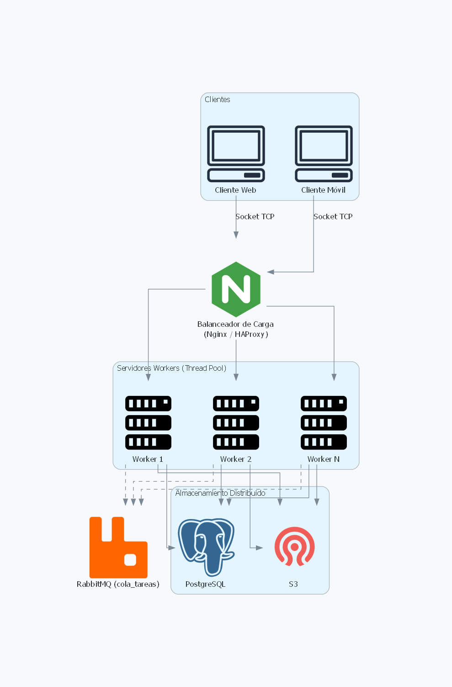

# PFO 3 — Sistema Distribuido Cliente-Servidor (Sockets + RabbitMQ)

Trabajo práctico de la materia. Se rediseña una aplicación como sistema
distribuido siguiendo el modelo **cliente-servidor**, usando **sockets TCP**,
un **pool de hilos** por servidor, **RabbitMQ** como cola de mensajes y
**PostgreSQL / S3** como almacenamiento distribuido.

## Arquitectura



- **Clientes** (web, móvil, desktop) → se conectan vía socket TCP.
- **Balanceador de carga** (Nginx / HAProxy) → reparte conexiones entre
  varios servidores worker.
- **Servidores worker** → cada uno tiene un `ThreadPoolExecutor` que atiende
  múltiples clientes en paralelo.
- **RabbitMQ** → cola `cola_tareas`. El servidor publica la tarea y espera
  la respuesta usando el patrón **RPC** (`reply_to` + `correlation_id`).
- **Workers (`worker.py`)** → consumen de la cola, procesan y devuelven el
  resultado. Se pueden lanzar N instancias en máquinas distintas.
- **Almacenamiento distribuido** → PostgreSQL para datos relacionales,
  S3 para objetos/archivos (a integrar en próximas iteraciones).

## Estructura del repositorio

```
pfo3_distribuido/
├── servidor.py
├── worker.py
├── cliente.py
├── requirements.txt
├── diagrama_arquitectura.png
└── README.md
```

## Requisitos

- Python 3.10+
- RabbitMQ corriendo en `localhost:5672`

### Levantar RabbitMQ con Docker

```bash
docker run -d --name rabbit -p 5672:5672 -p 15672:15672 rabbitmq:3-management
```

El panel de administración se encuentra en http://localhost:15672 (user/pass: `guest/guest`).

### Instalar dependencias

```bash
python -m venv .venv
source .venv/bin/activate         # en Windows: .venv\Scripts\activate
pip install -r requirements.txt
```

## Para ejecutarlo

Abrir **múltiples terminales**:

**Terminal 1 — Worker 1**

Linux :
```bash
WORKER_ID=W1 python worker.py
```
Windows (PowerShell):
```powershell
$env:WORKER_ID="W1"; python worker.py
```

**Terminal 2 — Worker 2** (opcional, para ver el balanceo)

Linux :
```bash
WORKER_ID=W2 python worker.py
```
Windows (PowerShell):
```powershell
$env:WORKER_ID="W2"; python worker.py
```

**Terminal 3 — Servidor**
```bash
python servidor.py
```

**Terminal 4 — Cliente**
```bash
python cliente.py            	# menú interactivo
```

## Protocolo

Cada mensaje es **una línea JSON** terminada en `\n`.

Ejemplo de tarea (cliente → servidor):
```json
{"tipo": "sumar", "payload": {"a": 5, "b": 7}}
```

Ejemplo de respuesta (servidor → cliente):
```json
{"ok": true, "resultado": 12, "worker": "W1"}
```

Tipos de tarea soportados:

| tipo       | payload                    | descripción                         |
|------------|----------------------------|-------------------------------------|
| `sumar`    | `{ "a": int, "b": int }`   | Suma de dos números                 |
| `factorial`| `{ "n": int }`             | Factorial de n                      |
| `saludo`   | `{ "nombre": str }`        | Devuelve un saludo                  |
| `lento`    | `{ "segundos": int }`      | Simula procesamiento (para probar concurrencia) |

## Probar la concurrencia
Lanzar dos workers (`W1` y `W2`) y desde dos terminales mandar tareas
`lento` con `segundos=10`. Se observa que se ejecutan en paralelo en distintos
workers (round-robin de RabbitMQ).

## Modelo de responsabilidad compartida
Para una infraestructura real:

- **El proveedor (AWS, Azure, etc.)** se encarga de la seguridad **de** la nube:
  hardware, hipervisor, red física, disponibilidad.
- **El desarrollador** es responsable de la seguridad **en** la nube:
  - Llaves SSH para acceso a los servidores worker.
  - Cortafuegos (UFW / Security Groups) exponiendo solo los puertos
    necesarios (5000 para sockets, 5672 para RabbitMQ interno).
  - VPN o subred privada para que los workers y RabbitMQ no estén expuestos.
  - SSL/TLS (PKI) para encriptar la comunicación con los clientes.


